# ESP32-P4 OpenVela 作品 · 架构与流程图（芯片适配 + 产品思路）

> 配套《技术报告》正文，聚焦**新硬件平台适配**主线，补充**产品思路**业务流程。所有图用 Mermaid 绘制，
> 可直接整体复制进飞书文档（```mermaid 代码块）或本地渲染。
> 代码基线：nuttx `65158c38a` / apps `f157001f6` / 专属仓 `967285f`。

## 图目录

| # | 图名 | 类型 | 对应章节 |
|---|------|------|----------|
| 1 | 系统总体架构（分层） | graph | 3.2 |
| 2 | 摄像头→显示零拷贝数据流（核心） | graph | 3.2 / 3.3 |
| 3 | MIPI-DSI 显示链路 | graph | 3.1 / 3.4 |
| 4 | MIPI-CSI 采集链路 | graph | 3.1 / 3.4 |
| 5 | 双缓冲切换时序 | sequence | 3.3 |
| 6 | 零拷贝 vs memcpy vs 逐像素（三条路径） | flowchart | 3.3 / 3.5 |
| 7 | 预览性能对比（fps） | xychart | 3.5 |
| 8 | Boot 启动流程 | state | 3.4 / 3.5 |
| 9 | campreview 预览执行流程 | flowchart | 3.4 |
| 10 | RISC-V 中断/CLIC 分发 | flowchart | 3.4 |
| 11 | ESP-HAL ABI 破坏→修复时序 | sequence | 3.4 |
| 12 | 软件模块架构 | graph | 3.4 |
| 13 | AI 应用链路（MiMo） | graph | 3.3 |
| 14 | 产品系统架构（端/云/用户三层） | graph | 产品思路 |
| 15 | 核心产品业务流程（定时抓拍→识别→推送） | flowchart | 产品思路 |
| 16 | 端云交互时序 | sequence | 产品思路 |
| 17 | 产品状态机 | state | 产品思路 |
| 18 | 绿植健康目标识别分类 | graph | 产品思路 |

---

## 图 1｜系统总体架构（分层）

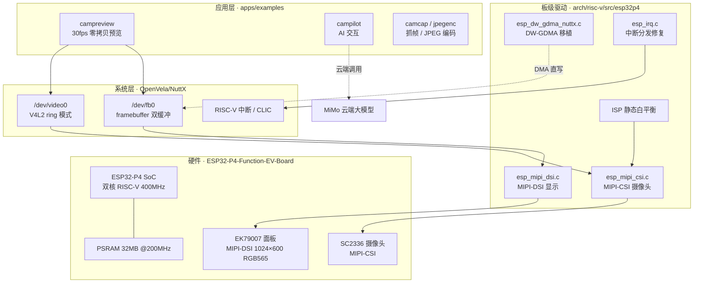

---

## 图 2｜摄像头→显示零拷贝数据流（核心）

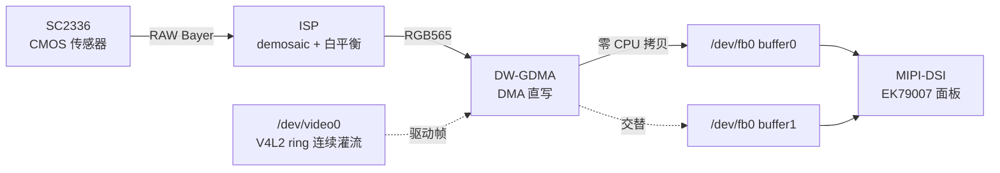

---

## 图 3｜MIPI-DSI 显示链路

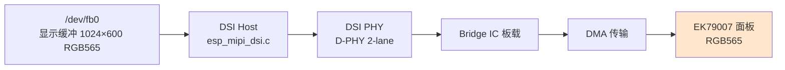

---

## 图 4｜MIPI-CSI 采集链路

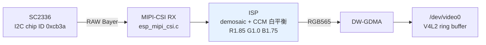

---

## 图 5｜双缓冲切换时序

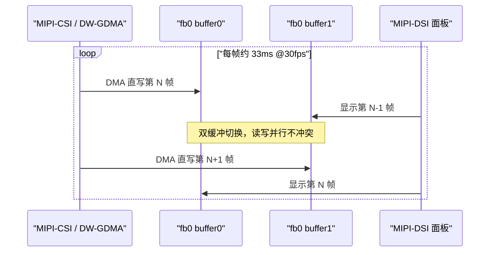

---

## 图 6｜零拷贝 vs memcpy vs 逐像素转换（三条路径）

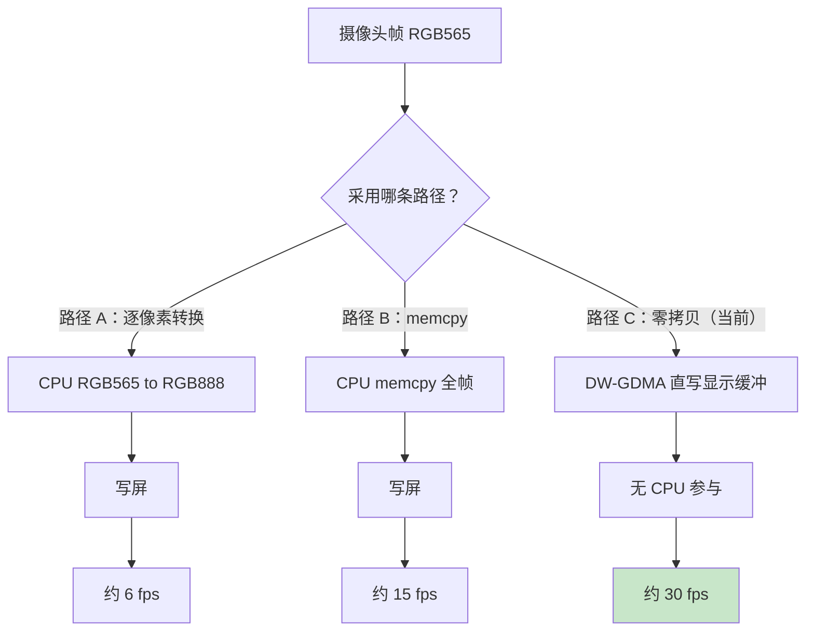

---

## 图 7｜预览性能对比（fps）

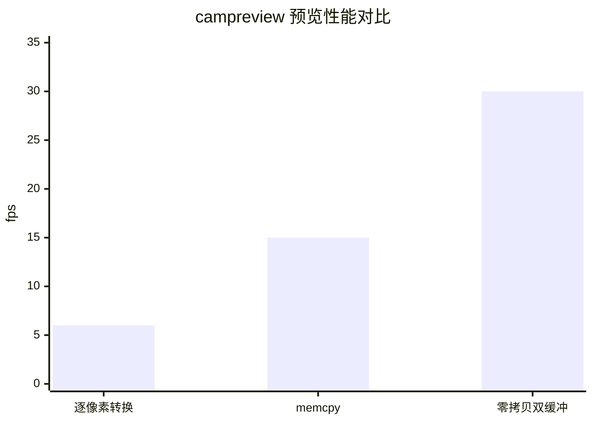

> 注：`xychart-beta` 需 Mermaid 10.x+；旧渲染器可跳过本图，数据同图 6。

---

## 图 8｜Boot 启动流程

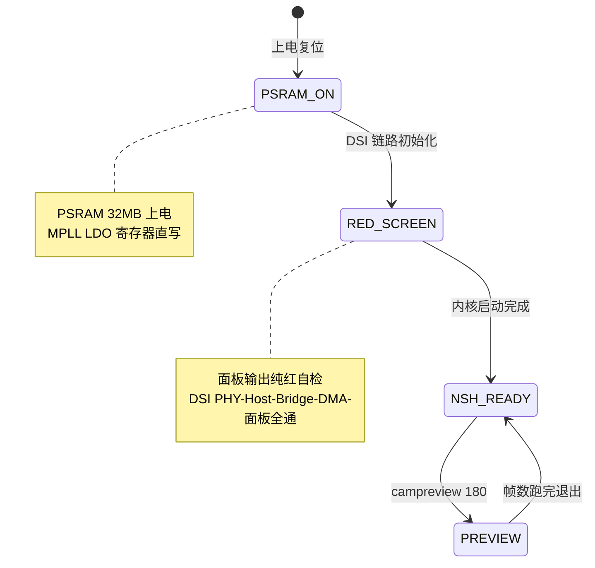

---

## 图 9｜campreview 预览执行流程

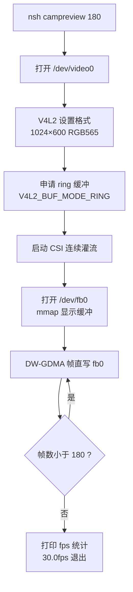

---

## 图 10｜RISC-V 中断/CLIC 分发流程

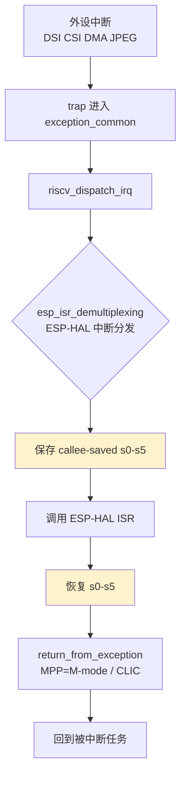

---

## 图 11｜ESP-HAL ABI 破坏→修复时序

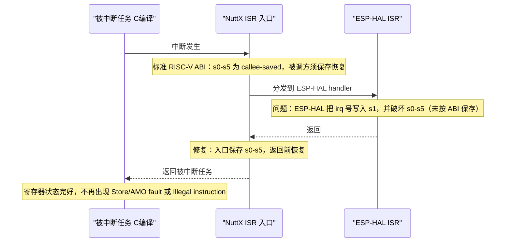

---

## 图 12｜软件模块架构

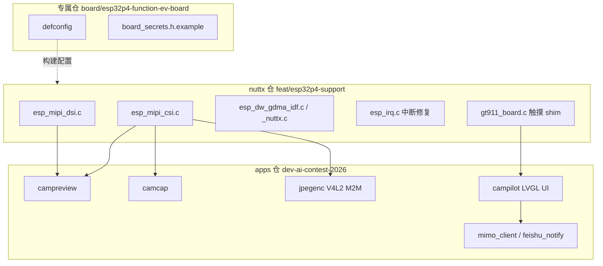

---

## 图 13｜AI 应用链路（MiMo，应用层辅助）

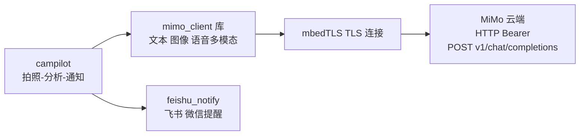

---

## 第二部分 · 产品思路流程图（业务层）

> 作品「绿盟守护者」的产品业务逻辑：绿植养护 AI 看护。
> 设备端**定时抓拍**绿植照片 → 云端 MiMo **目标识别**健康状态 → 异常时**推送飞书/微信提醒**。
>
> 注：当前代码 `campilot once` 为命令触发单次抓拍；「定时抓拍」为产品规划形态，
> 可由 NuttX timer / work queue 周期调度实现。

---

### 图 14｜产品系统架构（端 / 云 / 用户三层）

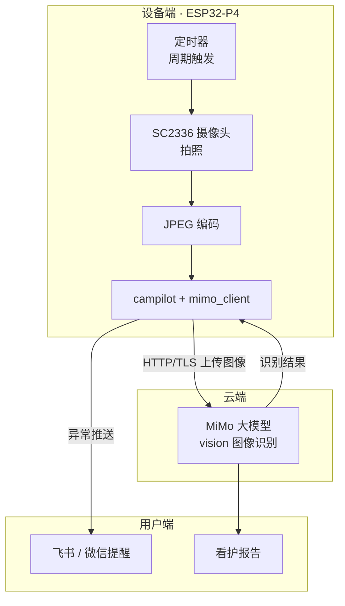

---

### 图 15｜核心产品业务流程（定时抓拍 → 目标识别 → 异常推送）

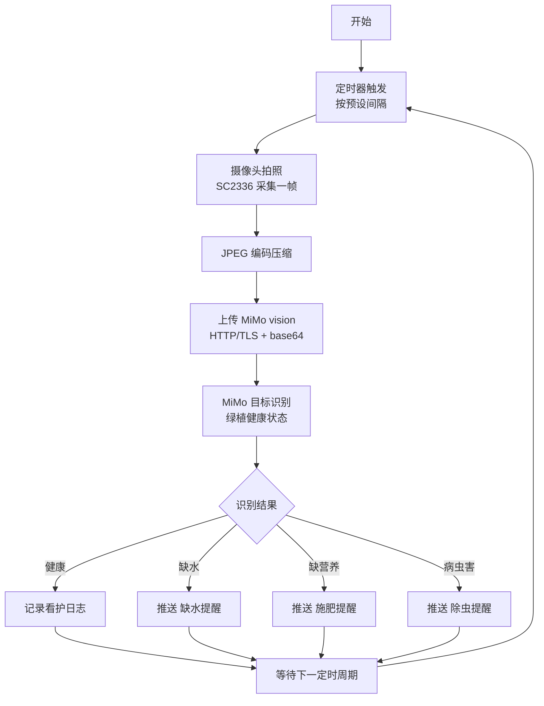

---

### 图 16｜端云交互时序

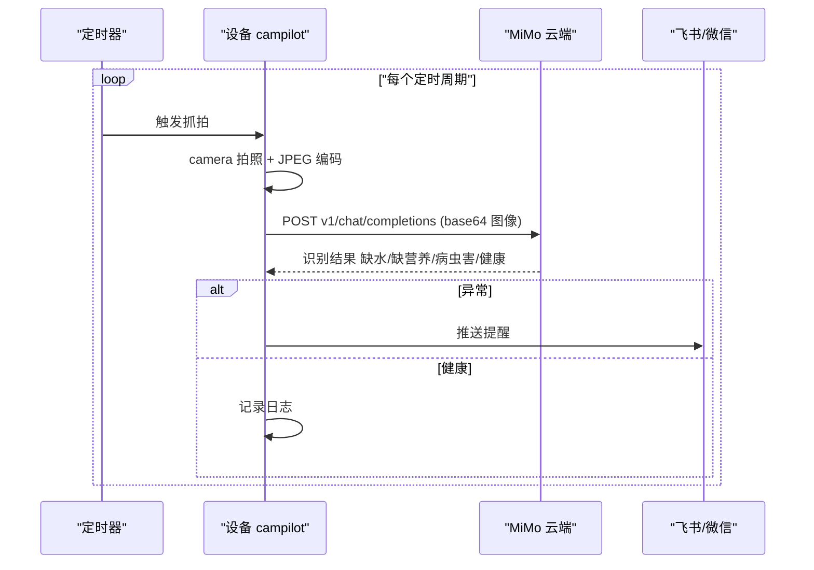

---

### 图 17｜产品状态机

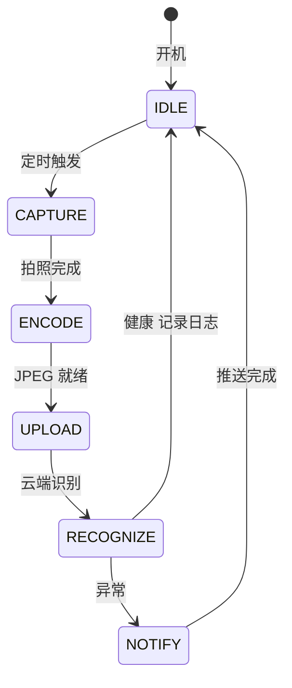

---

### 图 18｜绿植健康目标识别分类

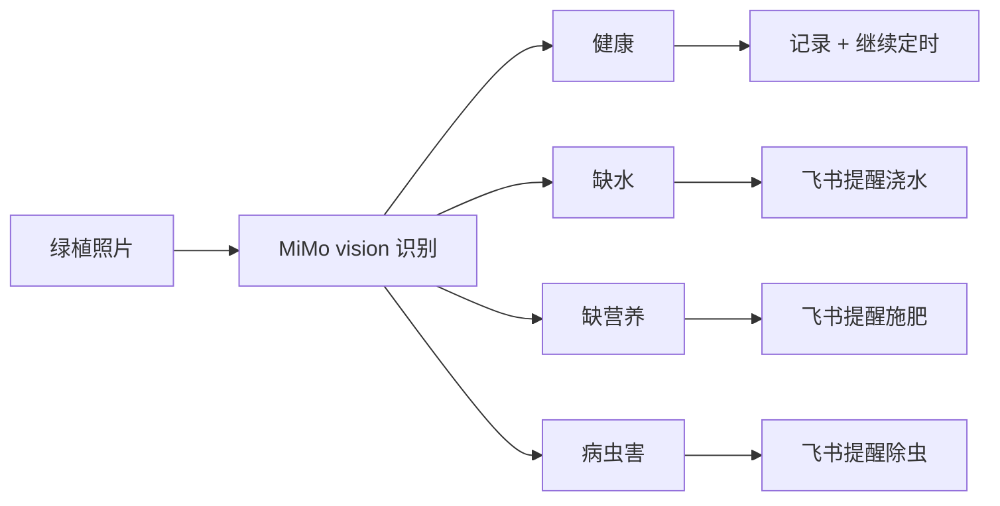

---

## 附：如何导入飞书

1. 在飞书技术报告文档中，光标定位到目标位置；
2. 插入 `代码块`，语言选 `Mermaid`（或直接粘贴 ```mermaid 围栏代码）；
3. 飞书会自动渲染为图（也可转成可编辑画板）。
