# 2026 首届 openvela AI 硬件开发者大赛 · 技术报告（终稿）

> 本文件按大赛《作品提交模板·第二节技术报告》整理，已基于最新代码同步（apps `f157001f6` / nuttx `65158c38a` / 专属仓 `967285f`），无剩余待填项。
> 正文插图均为 Mermaid 流程图，review 确认后可整体导入飞书渲染成图。

---

## 一、信息表

| 项目 | 内容 |
|------|------|
| 作品名称 | 绿盟守护者 |
| 队伍名称 | 绿盟守护者（编号 174） |
| 团队分工 | 姚靖威（独立完成：硬件适配、驱动开发、应用开发、调试、文档全部工作） |
| 选题方向 | AI 硬件产品创新 + 新硬件平台适配（组合） |

---

## 二、摘要

绿盟守护者是一款面向绿植养护的 AI 硬件产品：解决绿植缺乏全天候看护、主人因忙碌或出差错过浇水施肥时机导致绿植死亡的痛点。设备端 camera 定时拍照，经 MiMo 大模型识别绿植健康状态（缺水/缺营养/病虫害），异常时推送飞书/微信提醒。

技术上在乐鑫 ESP32-P4 上完成 OpenVela（NuttX 内核）全新硬件平台适配，打通 MIPI-DSI 显示（EK79007 1024×600 RGB565）与 MIPI-CSI 摄像头（SC2336）链路，移植 DW-GDMA，实现摄像头 DMA 直写显示缓冲的零拷贝预览达 30fps；另完成 32MB PSRAM 上电适配、ISP 白平衡、有线网络栈与 mbedTLS、MiMo 客户端。落地 openvela「图形 + 多媒体 + AI」能力。

### 产品思路（图示）

> 设备端**定时抓拍**绿植照片 → 云端 MiMo **目标识别**健康状态 → 异常时**推送飞书/微信提醒**。
> 注：当前代码 `campilot once` 为命令触发单次抓拍；「定时抓拍」为产品规划形态，可由 NuttX timer / work queue 周期调度实现。

**图 P1｜产品系统架构（端 / 云 / 用户三层）**

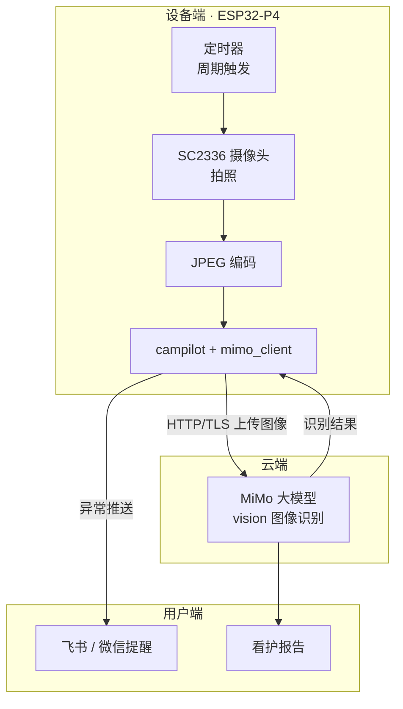

**图 P2｜核心产品业务流程（定时抓拍 → 目标识别 → 异常推送）**

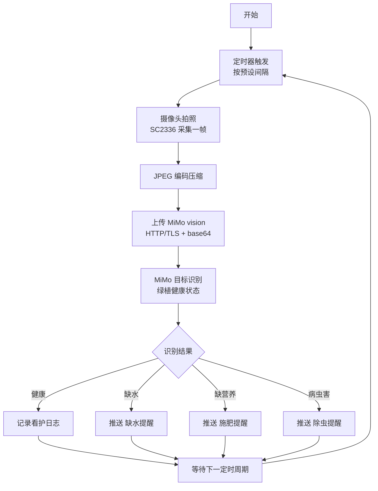

**图 P3｜端云交互时序**

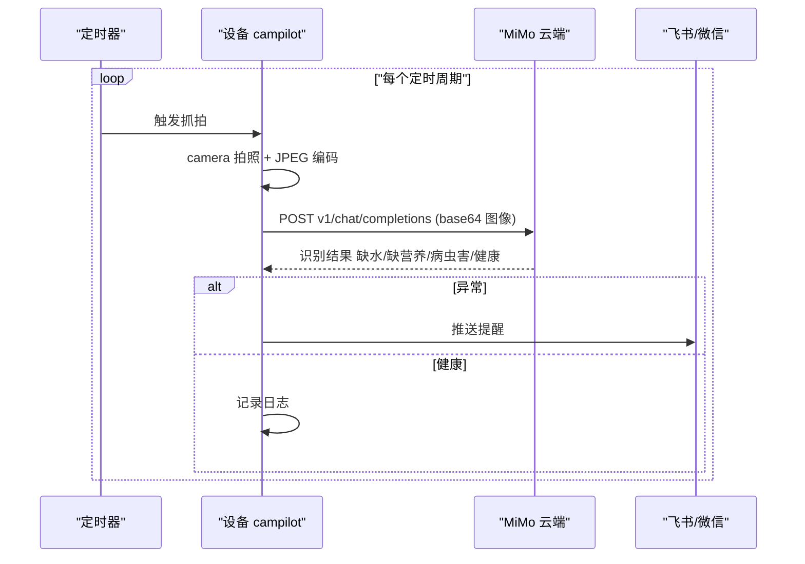

**图 P4｜产品状态机**

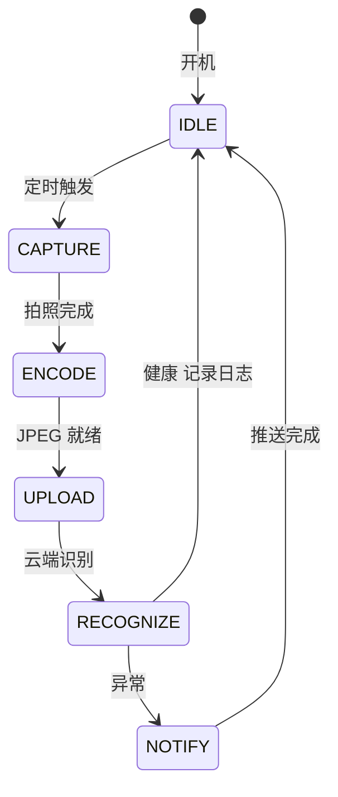

**图 P5｜绿植健康目标识别分类**

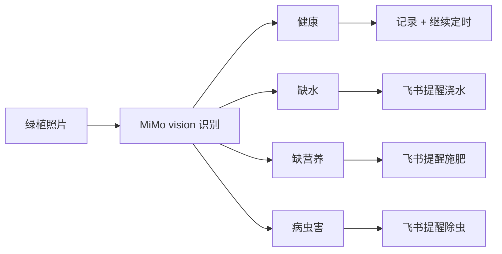

---

## 三、正文

### 3.1 绪论

**项目背景与问题定义**：openvela 是面向 AIoT 的开源操作系统，亟需扩展硬件生态；ESP32-P4 是乐鑫首款双核 RISC-V（400MHz）+ 原生 MIPI-DSI/CSI 的 SoC，此前无 openvela 支持，缺乏显示与摄像头驱动，开发者无法在该平台使用图形与多媒体能力。

**技术难点**：

1. MIPI-DSI 显示链路（DSI PHY → Host → Bridge → DMA → 面板）端到端打通
2. DW-GDMA 控制器从 ESP-IDF 到 NuttX 的移植
3. 32MB PSRAM 上电时序（MPLL LDO 寄存器直写）
4. MIPI-CSI 摄像头驱动 + ISP demosaic/白平衡
5. 摄像头 DMA 直写显示缓冲的零拷贝路径

**创新点**：

1. 全链路 RGB565 + 双缓冲，摄像头 DMA 直写显示缓冲，30fps 零拷贝预览
2. ISP CCM 静态白平衡（R 1.85× / G 1.0× / B 1.75×），无 AWB 硬件时校正 raw Bayer 绿偏

### 3.2 系统方案设计

**总体架构**（数据流）：`SC2336 摄像头 → MIPI-CSI → ISP → DW-GDMA → 显示缓冲(fb0) → MIPI-DSI → EK79007 面板`

**方案论证与选型**：选 ESP32-P4 因其原生 MIPI-DSI/CSI + 大容量 PSRAM + 双核 RISC-V，可承载摄像头预览等多媒体负载；端侧完成采集与显示，云端（MiMo）承担大模型推理，断网/弱网时本地仍可完成预览、抓帧、编码等降级功能。

**关键模块设计**：显示驱动（双缓冲 fb0）、摄像头驱动（V4L2 ring 模式）、DW-GDMA 适配层、ISP 白平衡。

**图 1｜系统总体架构（分层）**

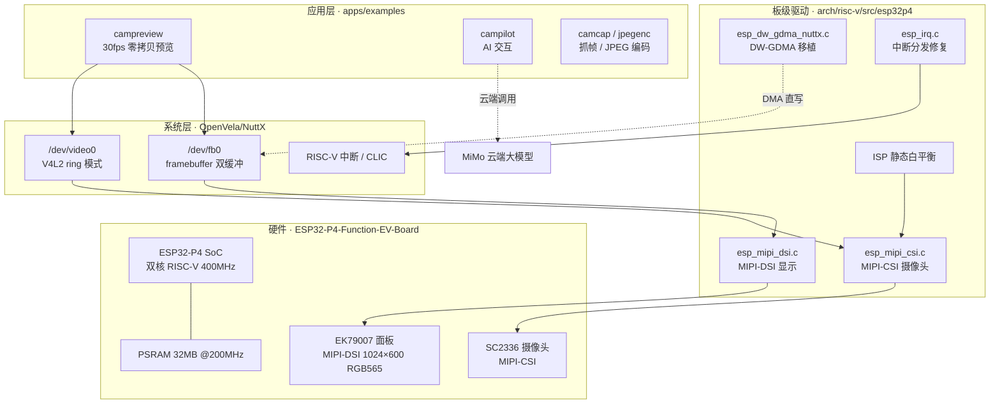

**图 2｜摄像头→显示零拷贝数据流（核心）**

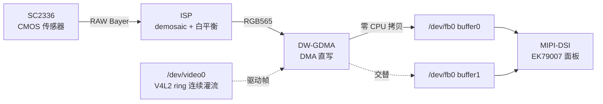

### 3.3 核心算法与技术原理

**AI 算法实现**：端侧无神经网络模型，AI 能力体现在云端 MiMo 大模型接入（`mimo_client` 库 + `campilot` 应用，HTTP/TLS 鉴权，支持文本/图像/语音多模态）。MiMo 采用 HTTP Bearer token 鉴权，POST /v1/chat/completions（文本/图像多模态），端侧由 mimo_client 库 + campilot 应用封装（mbedTLS 建 TLS 连接）。

**关键机制设计**：零拷贝调度——CSI 驱动以 `V4L2_BUF_MODE_RING` 连续灌流，DW-GDMA 将帧直写显示缓冲，避免 CPU memcpy。

**openvela 系统能力运用**：落地「图形」（`/dev/fb0` framebuffer）与「多媒体」（`/dev/video0` V4L2）两项；用到 openvela 的 framebuffer、V4L2、DMA 子系统，优化建议见 3.7。

**图 3｜双缓冲切换时序**

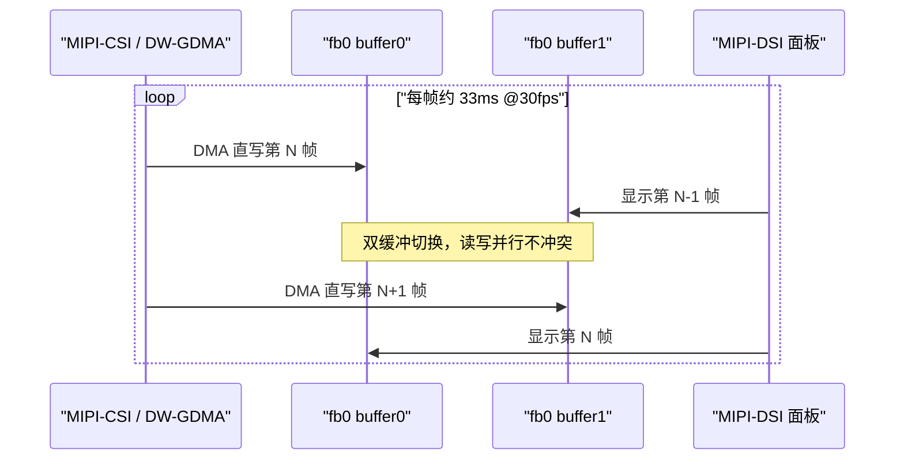

**图 4｜零拷贝 vs memcpy vs 逐像素转换（三条路径）**

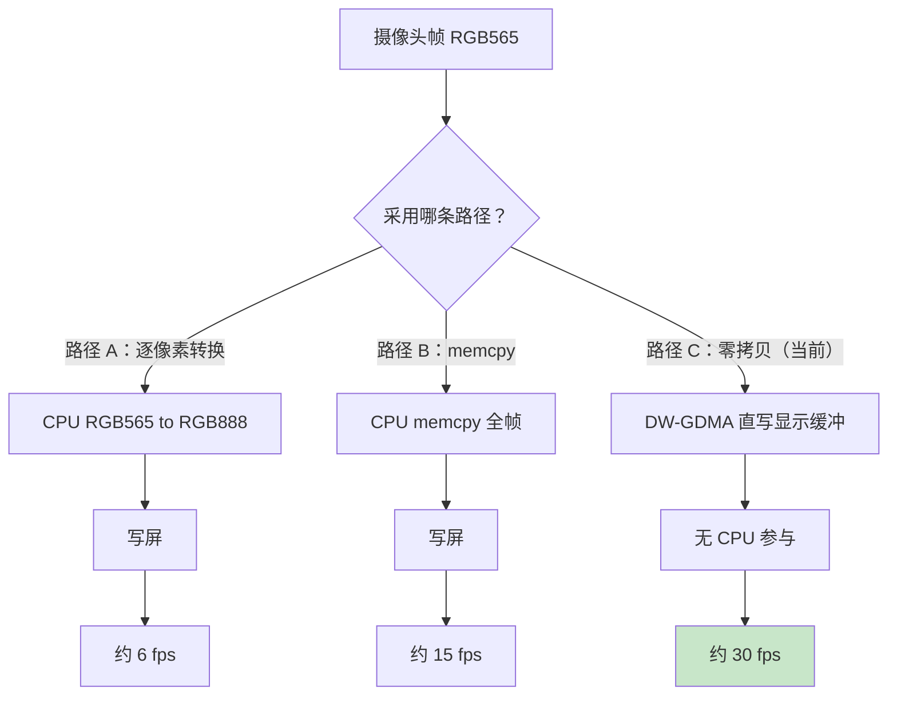

**图 5｜AI 应用链路（MiMo）**

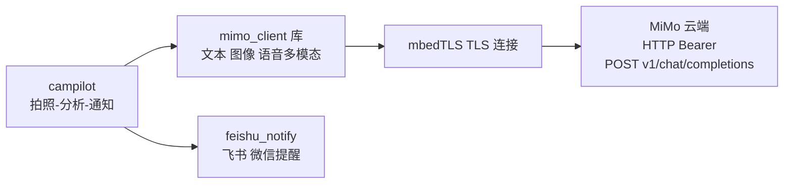

### 3.4 系统实现

**软件/固件架构**：NuttX 板级驱动（`esp_mipi_dsi.c`、`esp_mipi_csi.c`、DW-GDMA）+ apps 示例（`campreview` / `camcap` / `jpegenc` / `mimonet` / `campilot`）。

**图 6｜软件模块架构**

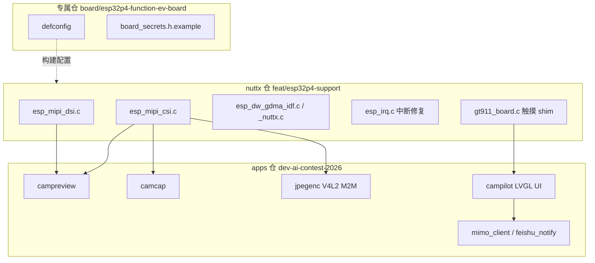

**数据流与关键流程**：开机红屏自检 → `campreview` 拉起 CSI 流 → DMA 直写 fb0 → 双缓冲切换 → 30fps。

**图 7｜Boot 启动流程**

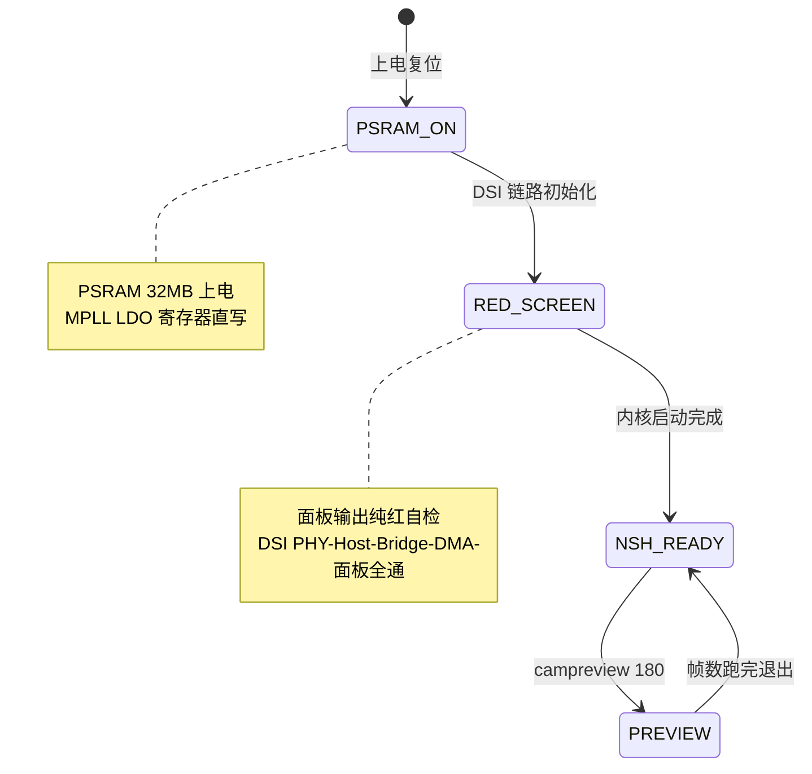

**图 8｜campreview 预览执行流程**

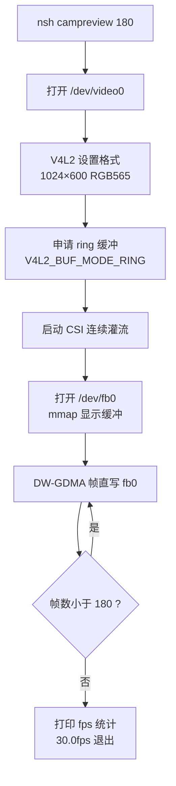

**硬件设计与适配**：全新硬件平台适配（**是**）。芯片 ESP32-P4，开发板 ESP32-P4-Function-EV-Board；新开发驱动：MIPI-DSI 显示、MIPI-CSI 摄像头、DW-GDMA、GT911 触摸、JPEG 编码器（V4L2 M2M）。适配难点：DSI 时序寄存器配置、CSI ring 缓冲要求、PSRAM 上电时序、RISC-V 中断/CLIC 与 ESP-HAL ABI 适配。关键 BOM：ESP32-P4 SoC（双核 RISC-V 400MHz）+ 32MB PSRAM（200MHz，MPLL LDO 直写）+ 16MB SPI Flash + EK79007 MIPI-DSI 面板（1024×600 RGB565）+ SC2336 MIPI-CSI 摄像头。

**图 9｜MIPI-DSI 显示链路**

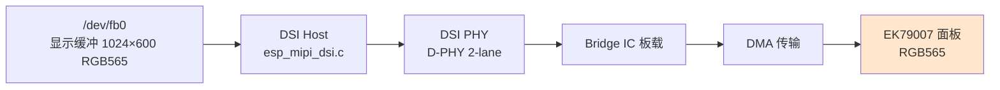

**图 10｜MIPI-CSI 采集链路**

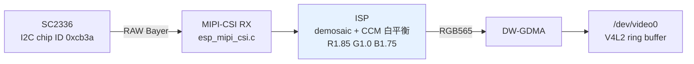

**图 11｜RISC-V 中断/CLIC 分发流程**

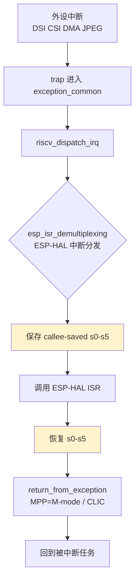

**图 12｜ESP-HAL ABI 破坏→修复时序**

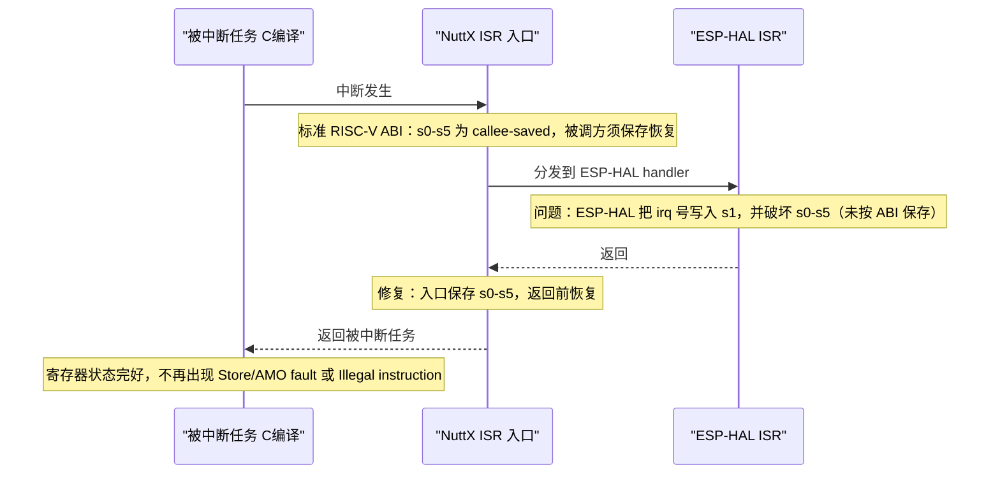

**应用/交互端**：NSH 命令行交互 + `campreview` 实时预览。

**自定义 Skill**：已沉淀 6 个自建 Skill + 1 个路由 Agent（esp32p4-serial-debug / build-flash / boot-diagnosis / interrupt-clic / multimedia / network-stack，及 esp32p4-debugger）；开发中另使用 openvela-build、nuttx-driver-development、contest-log-collector 等 Skill。

### 3.5 系统测试与结果分析

**测试环境**：ESP32-P4-Function-EV-Board + OpenVela，ESPTool 烧录，USB-Serial/JTAG 控制台。

**功能测试**：

| 功能 | 结果 |
|------|------|
| 开机显示自检（纯红屏） | 通过 |
| `/dev/fb0` 双缓冲 | 通过（yres_virtual=1200，fblen=2457600） |
| `/dev/video0` 摄像头 | 通过（SC2336 I2C chip ID 0xcb3a） |
| campreview 预览 | 通过，30.0fps 零拷贝 |

**性能测试**（1024×600 RGB565，每帧 PSRAM 流量约 1.23MB）：

| 阶段 | fps |
|------|-----|
| RGB565→RGB888 逐像素转换 | 6.0 |
| 全链路 RGB565 memcpy | 15.0 |
| 双缓冲零拷贝（当前） | **30.0** |

**图 13｜预览性能对比（fps）**

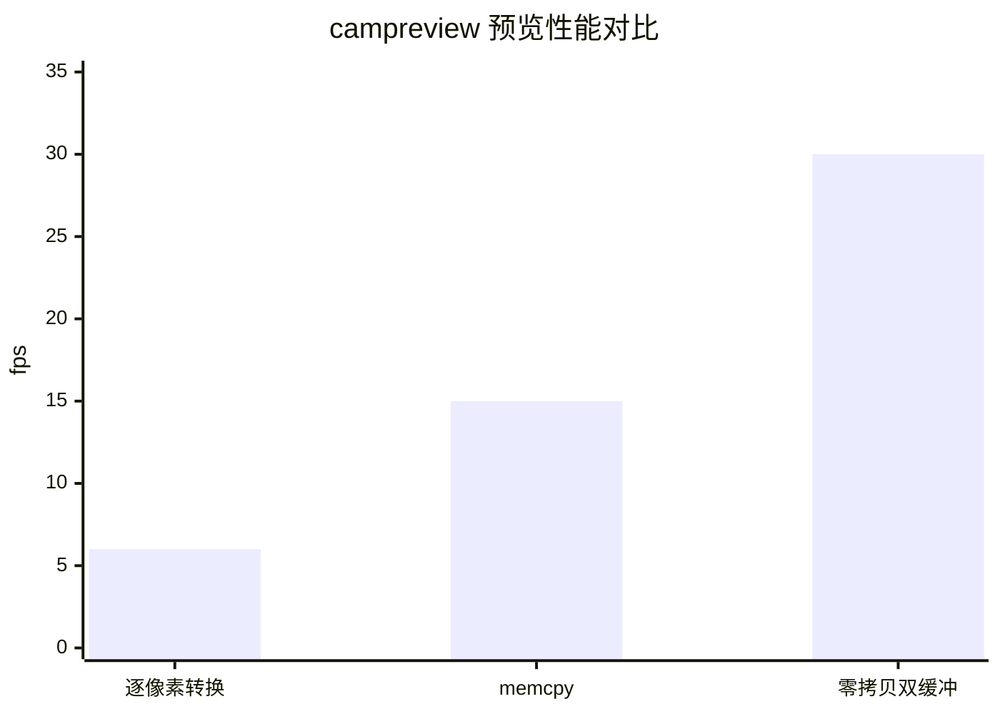

> 注：`xychart-beta` 需 Mermaid 10.x+；旧渲染器可跳过本图，数据同上表。

**可靠性与稳定性**：boot 到 NSH 稳定（已修复 esp_timer 回归导致的 LP WDT 复位循环）；campreview 连续多轮 180 帧预览稳定 30.0fps；PSRAM 32MB memtest（SPI SRAM memory test）通过。

### 3.6 AI-Native 开发说明

| 指标 | 数据 |
|------|------|
| AI Coding 代码占比 | 100%（口径：全部代码由 AI 辅助生成，人类负责需求定义、代码审查、集成与真机验证） |
| 使用的 AI 工具 | Claude Code、Kiro |
| MCP 工具使用情况 | 飞书 MCP、Gerrit MCP、IDE MCP 等 |
| Skills 使用与新增情况 | 使用 openvela-build / nuttx-driver-development / contest-log-collector 等；新增 6 个自建 Skill + 1 个 Agent（esp32p4-serial-debug 等，详见 3.4） |
| Token 使用总量 | 64 个会话、累计 33808 事件（口径：logs/ 里 manifest 的 event_count 累计，含 claude-code + kiro） |

**补充**：AI 工具在驱动寄存器调试、DSI/CSI 时序排查、PSRAM 上电等环节显著提升效率；遇到的问题：AI 对硬件寄存器细节易误判，需结合寄存器 dump 与示波器人工校验。

### 3.7 总结与展望

**成果总结**：完成 ESP32-P4 上 OpenVela 全新硬件平台适配——MIPI-DSI 显示与 MIPI-CSI 摄像头链路端到端打通、DW-GDMA 移植、32MB PSRAM 上电、RISC-V 中断/CLIC 适配，实现 30fps 零拷贝预览，boot 稳定到 NSH。

**应用前景与商业价值**：可作为 openvela 在 RISC-V + 多媒体 SoC 上的参考 BSP，用于 AI 摄像头、智能门锁/门铃、工业视觉等端侧设备。目标受众：家庭绿植爱好者、办公室绿化、小型园艺商家。痛点：绿植常因主人疏忽（出差/忙碌）错过浇水、施肥、病虫害防治时机而死亡。商业模式：设备端 camera 定时拍照 → MiMo 大模型识别绿植健康状态 → 异常（缺水/缺营养/病虫害）时推送飞书/微信提醒主人，可衍生订阅看护报告与硬件销售。

**不足与未来工作**：campilot 云端链路未跑通（DNS 解析失败）；AWB 尚未闭环（当前为固定增益）；JPEG 编码与触摸未完成板上验证。

---

## 四、评审维度对照

| 评审维度（分值） | 对应章节 |
|------|------|
| 技术难度（30） | 3.2 / 3.3 / 3.4 / 3.5 |
| 产品创新性（20） | 摘要 / 3.1 |
| 项目完整度（20） | 3.5 / 源码 / 展示照片 |
| AI 开发（10） | 3.3 / 3.6 |
| 商业潜力（10） | 3.7 |
| 展示效果（10） | 演示视频 / 海报 / PPT |

---

## 附：图清单与导入飞书说明

**图清单**（共 18 张：产品思路 P1–P5 + 技术架构 1–13）：

| 编号 | 图名 | 位置 |
|------|------|------|
| P1 | 产品系统架构（端/云/用户） | 摘要·产品思路 |
| P2 | 核心产品业务流程 | 摘要·产品思路 |
| P3 | 端云交互时序 | 摘要·产品思路 |
| P4 | 产品状态机 | 摘要·产品思路 |
| P5 | 绿植健康目标识别分类 | 摘要·产品思路 |
| 1 | 系统总体架构（分层） | 3.2 |
| 2 | 零拷贝数据流（核心） | 3.2 |
| 3 | 双缓冲切换时序 | 3.3 |
| 4 | 三条路径性能对比 | 3.3 |
| 5 | AI 应用链路（MiMo） | 3.3 |
| 6 | 软件模块架构 | 3.4 |
| 7 | Boot 启动流程 | 3.4 |
| 8 | campreview 执行流程 | 3.4 |
| 9 | MIPI-DSI 显示链路 | 3.4 |
| 10 | MIPI-CSI 采集链路 | 3.4 |
| 11 | RISC-V 中断/CLIC 分发 | 3.4 |
| 12 | ESP-HAL ABI 修复时序 | 3.4 |
| 13 | 预览性能对比（fps） | 3.5 |

**导入飞书步骤**：确认本稿无误后，在飞书技术报告文档中逐段粘贴，Mermaid 代码块语言选 `Mermaid` 即自动渲染成图。
